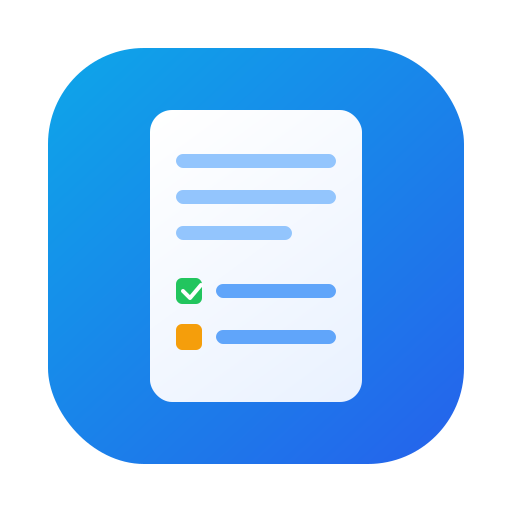

# Notes App API

<p align="center">
  
</p>

Simple REST API for creating, reading, updating, and deleting notes using **Node.js**, **Express**, and **MongoDB**.

## Features
- Create a single note
- Create multiple notes in bulk
- Get all notes
- Get a single note by ID
- Replace a note (PUT)
- Update specific fields (PATCH)
- Delete one note
- Delete multiple notes

## Tech Stack
- Node.js
- Express.js
- MongoDB + Mongoose
- dotenv
- nodemon (dev)

## Project Structure
```text
notes-app/
  src/
    app.js
    index.js
    config/db.js
    controllers/note.controllers.js
    models/note.model.js
    routes/note.routes.js
  assets/
    notes-logo.svg
  package.json
  .env
```

## Note Schema
Each note includes:
- `title` (String, required)
- `content` (String, required)
- `category` (String, enum: `work | personal | study`, default: `study`)
- `isPinned` (Boolean, default: `false`)

## Setup and Run
1. Install dependencies:
```bash
npm install
```

2. Create `.env` file in project root:
```env
PORT=5000
MONGO_URI=your_mongodb_connection_string
```

3. Start server:
```bash
npm run dev
```
or
```bash
npm start
```

Base URL:
```text
http://localhost:5000
```

## API Endpoints
All note routes are under:
```text
/api/notes
```

### Health/Test
- `GET /api/notes/test`

### Create One Note
- `POST /api/notes/create`
- Body:
```json
{
  "title": "My first note",
  "content": "This is content",
  "category": "study",
  "isPinned": false
}
```

### Create Notes in Bulk
- `POST /api/notes/bulk-create`
- Body:
```json
{
  "notes": [
    { "title": "Note 1", "content": "Content 1", "category": "work" },
    { "title": "Note 2", "content": "Content 2", "category": "personal" }
  ]
}
```

### Get All Notes
- `GET /api/notes`

### Get Note by ID
- `GET /api/notes/:id`

### Replace Full Note
- `PUT /api/notes/:id`
- Body must include full required fields:
```json
{
  "title": "Updated title",
  "content": "Updated content",
  "category": "study",
  "isPinned": true
}
```

### Update Specific Fields
- `PATCH /api/notes/:id`
- Example:
```json
{
  "content": "Only this field is updated"
}
```

Allowed fields in PATCH:
- `title`
- `content`
- `category`
- `isPinned`

### Delete One Note
- `DELETE /api/notes/:id`

### Delete Multiple Notes
- `DELETE /api/notes/bulk`
- Body:
```json
{
  "ids": ["noteId1", "noteId2", "noteId3"]
}
```

## Important Request Tip
When using Postman for `POST`, `PUT`, and `PATCH`:
- choose `Body -> raw -> JSON`
- send valid JSON only (no trailing commas)
- `Content-Type` should be `application/json`

## Scripts
- `npm run dev` - start with nodemon
- `npm start` - start with node

## Author
Chirag Prajapat
